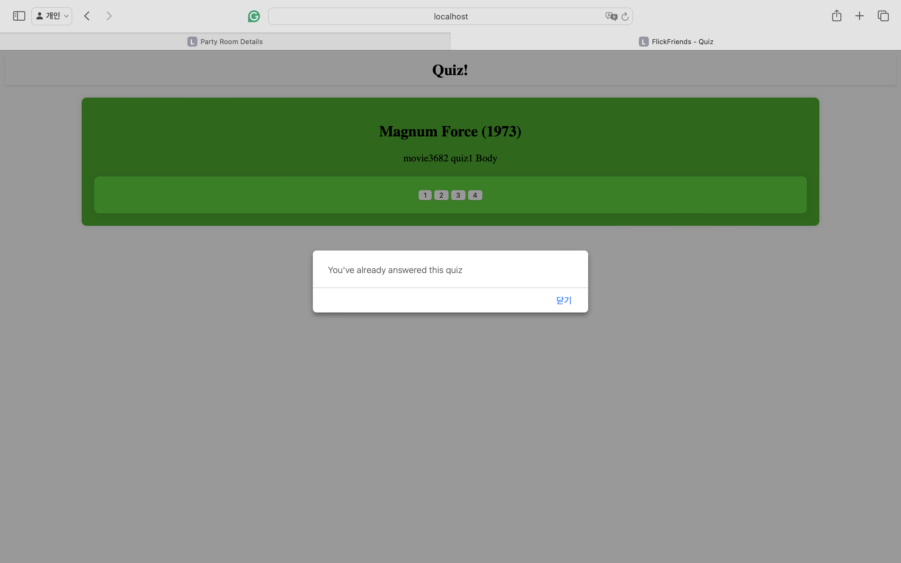
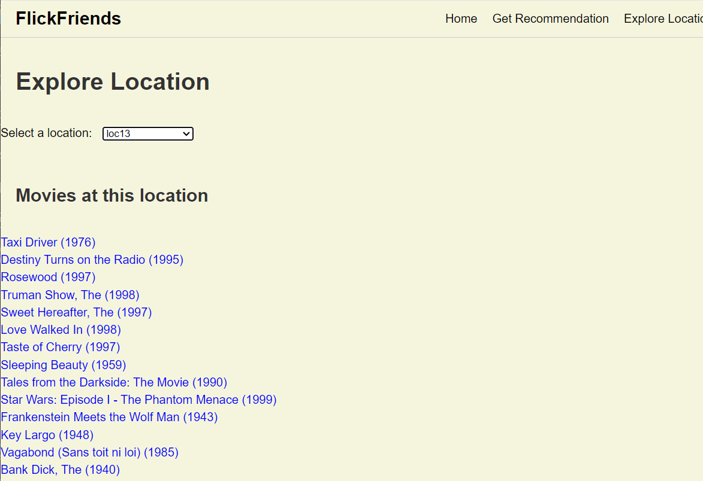

# FlickFriends

Welcome to Flick Friends! Our product, called FlickFriends, is a new social network for movie lovers. It's a place where people who enjoy movies can connect with others, share their favorite films, and discover new ones, all while having fun together.

## Table of Contents

1. [Introduction](#introduction)
2. [Getting Started](#getting-started)
    - [Installation](#installation)
    - [Access Webpage](#Access-webpage)
3. [Features](#features)
    - [Party Room](#01.PartyRoom)
    - [Quiz](#02.Quiz)
    - [Location based Recommendation](#03.Location-based-recommendation)
4. [For Developers](#for-developers)
    - [Contributing](#contributing)

## Introduction

FlickFriends solves the problem of feeling disconnected while watching movies. Many existing platforms like Netflix don't let users chat with friends in real-time or explore movie details beyond basic ratings. This can make movie-watching feel lonely and limited. Users miss out on discussing films with others and discovering new movies beyond what they see.

Users can easily access FlickFriends from their WEB browser. They can join movie events, explore filming locations, and take part in quizzes and discussions—all to make their movie experience more enjoyable.

By providing everything movie-related in one place, FlickFriends makes it easy to discover, discuss, and enjoy films. The platform's simple design and many features give users quick access to lots of movie content, making them feel part of a fun movie-loving community. Whether users want entertainment, information, or just to chat, FlickFriends makes it easy and fun.

## Getting Started

To start using FlickFriends, follow these simple steps:

### Installation

1. Clone the repository:
    ```sh
    git clone https://github.com/cse364-unist/projects-group1.git
    ```
2. Navigate to the project directory:
    ```sh
    cd projects-group1
    ```
3. Build the Docker image:
    ```sh
    docker build -t flickfriends/milestone3 .
    ```
4. Run the Docker container:
    ```sh
    docker run -it -p 8080:8080 flickfriends/milestone3
    ```
5. Inside the Docker container, execute the following script to start the server and run the web application:
    ```sh
    ./run.sh
    ```

### run.sh

Here is the content of the `run.sh` script that needs to be executed inside the Docker container:

```sh
git clone https://github.com/cse364-unist/projects-group1.git
cd projects-group1/
git checkout milestone3_Application

mongod --fork --logpath /var/log/mongodb.log
mongosh admin --eval "db.createUser({ user: 'user', pwd: 'password', roles: ['userAdminAnyDatabase'] })"
mongoimport --db=assign1 --collection=movie --authenticationDatabase admin --username user --password password --type=csv --file=data/movies.csv --fields=movieId.int32(),name.string(),genre.string(),placeId.int32() --columnsHaveTypes
mongoimport --db=assign1 --collection=rating --authenticationDatabase admin --username user --password password --type=csv --file=data/ratings.csv --fields=userId.int32(),movieId.int32(),rating.int32(),timestamp.string() --columnsHaveTypes
mongoimport --db=assign1 --collection=user --authenticationDatabase admin --username user --password password --type=csv --file=data/users.csv --fields=userId.int32(),gender.string(),age.int32(),occupation.int32(),zipCode.string(),point.int32(),movieStatus.int32(),latitude.double(),longitude.double(),hobby.int32(),favoriteFood.int32() --columnsHaveTypes
mongoimport --db=assign1 --collection=place --authenticationDatabase admin --username user --password password --type=csv --file=data/moviePlaces.csv --fields=placeId.int32(),name.string(),latitude.double(),longitude.double(),hobby.int32(),favoriteFood.int32() --columnsHaveTypes
mongoimport --db=assign1 --collection=quiz --authenticationDatabase admin --username user --password password --type=csv --file=data/quizzes.csv --fields=quizId.int32(),movieId.int32(),quizNum.int32(),quizBody.string(),quizAnswer.int32() --columnsHaveTypes

mvn jacoco:report 
mvn clean package 
rm -rf /root/project/tomcat/webapps/ROOT
cp target/cse364-project.war /root/project/tomcat/webapps/ROOT.war
cd /root/project/tomcat/bin
./catalina.sh run
```

### Access Webpage

On the main page, you can access Partyroom, Location-Based Recommendation, Profile, and Login. As the User ID, you can use an integer from 1 to 4040 (because it fetches 4040 users from the database). In profile, you can check your logined User Id and logout.

## Features

Our product comes with three key features to enhance your experience:

### 01.PartyRoom

One of the key features of our proposed movie product is the "Party Room" functionality, inspired by services like Watcha and Naver-Vibe. This feature allows users to join virtual rooms created by a host to watch movies in real-time, enhancing community engagement. 

- **Direct Access:** You can access the Party Room directly via [http://localhost:8080/partyroom.html](http://localhost:8080/partyroom.html).


In the Party Room, you will see a list of movies that are displayed with their genres. These movies are fetched randomly from the database to ensure a variety of genres each time. When you click the white “Movie List” header at the top, the page will reload, providing you with a new set of movies to explore.

At the bottom of the page, you will find the “Add New Content” section. This feature allows users to enter the title of a movie or content they wish to add, enabling the creation of new party rooms.


You can see the results of typing "Software Engineering" and pressing the "Add Content" button on the right in the screenshot above. These created contents can also be deleted through the "DELETE" button.

Now, let's try accessing each party room. Click the "Magnum Force (1973)" button in the picture to link to a new webpage: [http://localhost:8080/partyroom_detail.html?id=3682&type=movie](http://localhost:8080/partyroom_detail.html?id=3682&type=movie). This link directs you to the `partyroom_detail.html` file, where the specific page is generated based on the unique ID and type of content (whether it's a movie or other types of content). 


Each party room webpage includes live chat functionality and video streaming capabilities. (Due to the large file size required for live video streaming, this project substitutes the video with images.) The live chat feature is fully functional. Users accessing the same URL (mapped by the ID and type) can engage in real-time chat, enhancing the interactive experience.


Finally, you can use the quiz system related to movies by pressing the quiz button at the bottom of the web page, which will be followed by the following features.

### 02. Quiz

This feature is organically connected with the "Party Room". Our product focuses on creating a user-friendly movie streaming platform that emphasizes community engagement and enjoyment. One of the key features we're implementing is a point system designed to enhance user interaction and participation. Users will be able to stream movies together, regardless of their physical locations, and engage in activities like quizzes and reviews to earn points.

#### Quiz Examples

Below are examples of the quiz feature in action:

- **Quiz Example:** This is a standard view of a quiz for the example movie "Magnum Force (1973)". Users can select their answers from the given options.


- **Wrong Answer:** When a user selects the wrong answer, a message will appear indicating that the answer is incorrect.


- **Already Answered:** If a user tries to answer a quiz they have already completed, a message will notify them that they have already answered this quiz.



These features are designed to make the viewing experience more interactive and engaging, encouraging users to participate in community activities and enhancing their overall experience on the platform.


### 03.Location-Based-Recommendation

One of the features we need to implement is location-based-recommendation. This feature makes it easy to obtain information about movie filming locations and provides recommendations to users who want to travel to movie locations.

Direct access: You can access directly via http://locathost:8080/locationmain.html.


First, you can select a movie from the list of movies on the 'locationmain' page. When you select a movie, information about the filming location of the movie will pop up below and you can check it.


If you click 'Get Recommendation' in the menu above, you can go to the page where you can receive recommendations for filming locations.

You can receive two recommendations. First, based on distance, enter the number next to the km next to the threshold of how far you are willing to go from your home location and click the 'Find Locations' button next to it to see shooting locations smaller than that distance.

Next, you can receive recommendations based on your hobbies and food preferences. This can be viewed by pressing the 'Find Recommendations' button. Types of hobbies include:
There are 5 categories: 'Tourism', 'Leisure', 'Cafe', 'Nature', and 'Recreation', and the foods include 'Korean food', 'Chinese food', 'Japanese food', 'Western food', and 'Dessert'. There are 5.



If you click 'Explore Location' in the menu above, you can see a list of movies by filming location.

If you go to the explore location tab and select a filming location, you can see a list of movies filmed at that filming location. Just select the desired filming location from the list next to ‘Select a location’.

## For Developers

If you’re interested in contributing to our product, here’s how you can get started.

### Contributing

We welcome contributions! Here’s how you can help:

1. Fork the repository.
2. Create a new branch: `git checkout -b feature/YourFeature`
3. Make your changes and commit them: `git commit -m 'Add some feature'`
4. Push to the branch: `git push origin feature/YourFeature`
5. Open a pull request.

